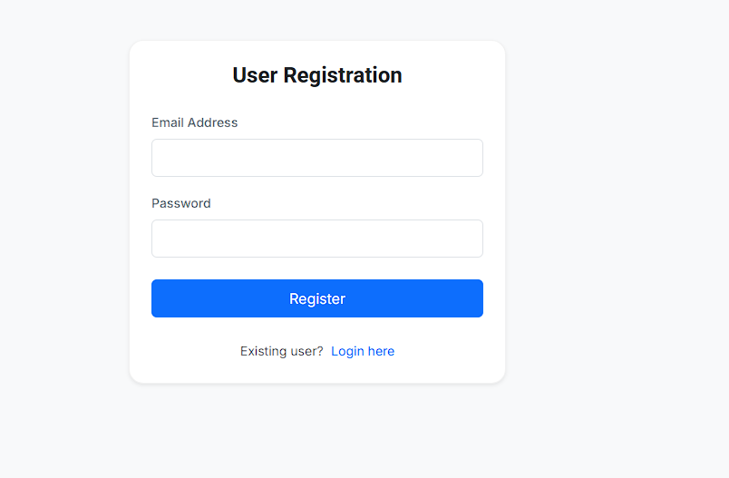
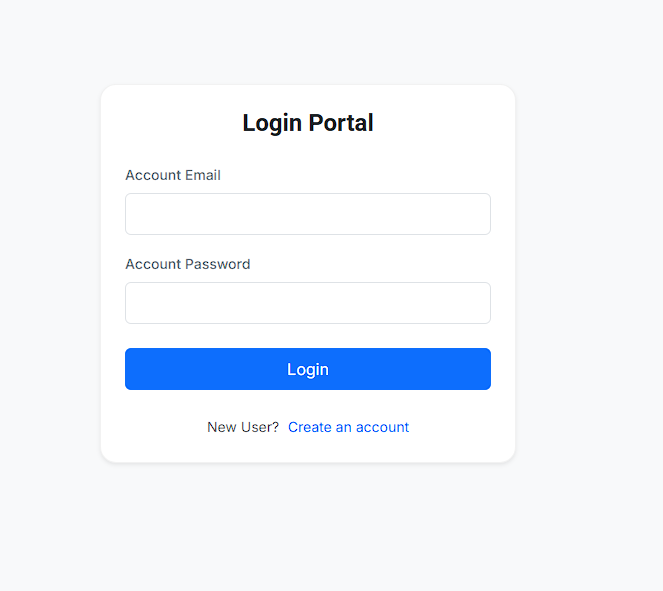
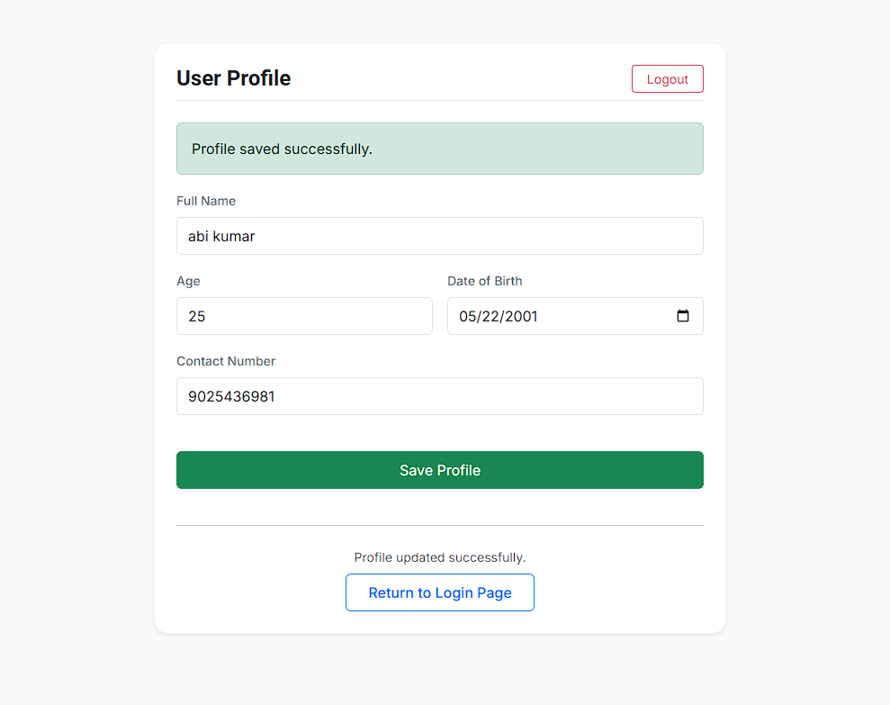

# GUVI Task — Register • Login • Profile

A full-stack web application implementing a complete user authentication and profile management flow, built to a strict technical specification: fully decoupled HTML/CSS/JS/PHP, jQuery + AJAX only (no native form submissions), a dual-database architecture (MySQL for auth, MongoDB for profile data), and Redis-backed sessions with zero reliance on PHP's native session handling.

## Features

- **Registration** with client-side validation for email format and strong passwords (min. 8 characters, at least one uppercase, one lowercase, one digit, and one special character), plus server-side uniqueness enforcement against the MySQL `users` table.
- **Login** with credential verification via `password_verify()` against bcrypt-hashed passwords, returning a cryptographically random session token (`bin2hex(random_bytes(32))`).
- **Stateless-on-the-frontend sessions** — the session token is stored exclusively in the browser's `localStorage` (no PHP sessions, no cookies). Every authenticated request passes the token explicitly to the backend.
- **Redis-backed session store** on the backend — tokens are written to Redis with a 1-hour TTL and validated on every protected request; expired or missing tokens trigger an automatic redirect back to login.
- **Profile management** (name, date of birth, contact number) stored separately in MongoDB, keyed by the authenticated user's ID, with:
  - Auto-calculated age from date of birth
  - Name field restricted to alphabetic characters
  - Contact number restricted to exactly 10 digits
- **Session timeout handling** — if a request comes back unauthorized (expired/invalid token), the UI surfaces a clear message and redirects to login after a short delay.
- **Fully AJAX-driven UI** — all three pages (Register, Login, Profile) use `type="button"` elements and jQuery `$.ajax()` calls exclusively; there is no native HTML form submission anywhere in the app.
- **Responsive, minimal-font design** — Bootstrap grid/components for layout, capped at two typefaces (Inter for body text, Roboto for headings), and SVG-only iconography.

## Technology Stack

**Frontend**
- HTML5, CSS3 (Bootstrap 5)
- JavaScript (jQuery 3.7) — DOM manipulation and AJAX only
- Fonts: [Inter](https://fonts.google.com/specimen/Inter), [Roboto](https://fonts.google.com/specimen/Roboto)

**Backend**
- PHP (PDO for MySQL, MongoDB PHP Library, Predis for Redis)
- Composer for dependency management

**Data layer**
- **MySQL** — registered user credentials (`users` table), accessed exclusively through prepared statements
- **MongoDB** — user profile documents (`guvi_task.profiles`), keyed by user ID
- **Redis** — server-side session storage, decoupled from PHP's native session engine

**Hosting**
- Deployed on [ AWS — http://16.16.66.84/guvi_task/ ]

## Project Demo

**Register**



**Login**



**Profile**



**Live demo:** http://16.16.66.84/guvi_task/

## Installation

### Prerequisites
- PHP 8.0+
- Composer
- MySQL server
- MongoDB Atlas cluster (or local MongoDB instance)
- Redis server

### Steps

1. **Clone the repository**
   ```bash
   git clone https://github.com/Abisheik2205/guvi-task.git
   cd guvi-task
   ```

2. **Install PHP dependencies**
   ```bash
   composer install
   ```

3. **Configure environment variables**

   Create a `.env` file in the project root:
   ```env
   DB_HOST=your_mysql_host
   DB_NAME=your_database_name
   DB_USER=your_mysql_user
   DB_PASS=your_mysql_password

   MONGO_URI=your_mongodb_atlas_connection_string

   REDIS_HOST=your_redis_host
   REDIS_PORT=your_redis_port
   ```

4. **Set up the MySQL database**
   ```sql
   CREATE DATABASE your_database_name;
   USE your_database_name;

   CREATE TABLE users (
     id INT AUTO_INCREMENT PRIMARY KEY,
     email VARCHAR(255) UNIQUE NOT NULL,
     password VARCHAR(255) NOT NULL
   );
   ```

5. **Start Redis** (locally, or point `REDIS_HOST`/`REDIS_PORT` at a hosted instance)
   ```bash
   redis-server
   ```

6. **Serve the application**
   ```bash
   php -S localhost:8000
   ```
   Or point your local Apache/XAMPP virtual host at the project root.

7. **Open the app**

   For local development, navigate to `http://localhost:8000/register.html` to create an account, then log in and manage your profile.


## Project Structure

```
guvi-task/
├── index.html
├── login.html
├── register.html
├── profile.html
├── screenshots/
│   ├── register.png
│   ├── login.png
│   └── profile.png
├── css/
│   └── style.css
├── js/
│   ├── login.js
│   ├── register.js
│   └── profile.js
├── php/
│   ├── login.php
│   ├── register.php
│   └── profile.php
├── composer.json
└── .env (not committed)
```
